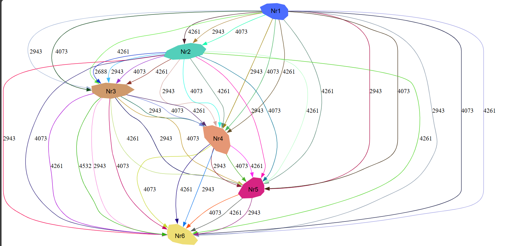
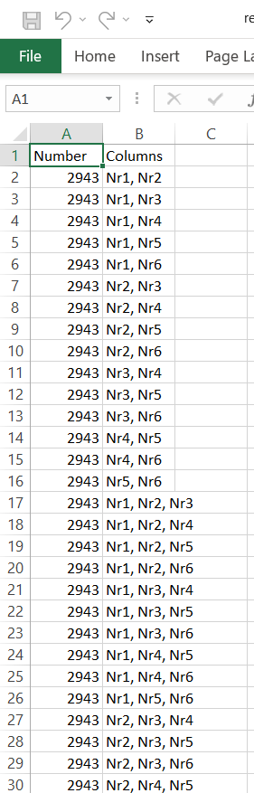
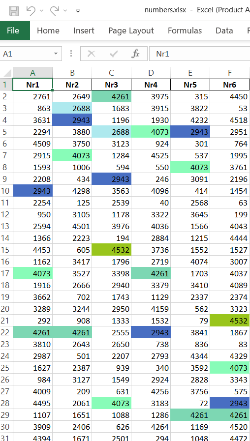
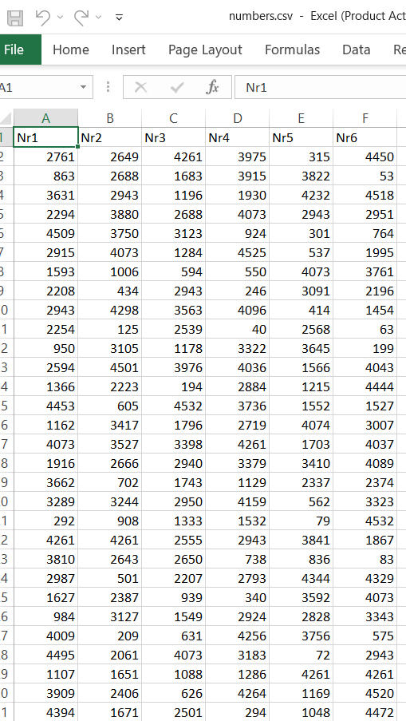

# Random Number Generator and Analyzer

Acest proiect constă în trei scripturi Python care generează numere aleatoare, analizează repetițiile acestora și creează vizualizări grafice ale datelor.

## Descrierea proiectului

1. **generate_numbers.py**: Generează numere aleatoare unice într-un interval specificat și le salvează într-un fișier Excel și CSV. De asemenea, colorează celulele din fișierul Excel pentru numerele care se repetă.

2. **graf.py**: Analizează fișierul Excel generat de `generate_numbers.py` și creează un graf folosind Graphviz pentru a vizualiza numerele care se repetă în mai multe coloane.

3. **repetari.py**: Analizează fișierul Excel generat de `generate_numbers.py` și salvează numerele care se repetă în mai multe coloane într-un fișier CSV, într-un format de graf matematic.

## Cum să folosești

1. **Instalare dependențe**:
   Asigură-te că ai instalat toate dependențele necesare rulând:
   ```bash
   pip install -r requirements.txt


   


## Imagini

### Prezentare 1



### Prezentare 2



### Prezentare 3



### Prezentare 4


